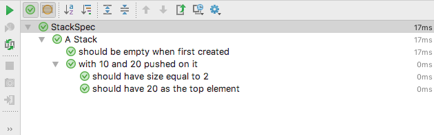

# Specnaz

[](https://opensource.org/licenses/Apache-2.0)
[](https://maven-badges.herokuapp.com/maven-central/org.specnaz/specnaz)
[](https://github.com/skinny85/specnaz/actions/workflows/build.yaml)

### Library for writing beautiful, [RSpec](http://rspec.info)/[Jasmine](http://jasmine.github.io)/[Mocha](https://mochajs.org)/[Jest](https://facebook.github.io/jest)-style specifications in Java, [Kotlin](https://kotlinlang.org) and [Groovy](http://www.groovy-lang.org)


### First example

```java
import org.specnaz.Specnaz;
import org.specnaz.junit.SpecnazJUnit;
import org.specnaz.junit.SpecnazJUnitRunner;
import org.junit.runner.RunWith;
import org.junit.Assert;
import java.util.Stack;

// You can also say:
// public class StackSpec extends SpecnazJUnit {{
// - in that case, you can drop the @RunWith annotation
@RunWith(SpecnazJUnitRunner.class)
public class StackSpec implements Specnaz {{
    describes("A Stack", it -> {
        Stack<Integer> stack = new Stack<>();

        it.should("be empty when first created", () -> {
            Assert.assertTrue(stack.isEmpty());
        });

        it.endsEach(() -> {
            stack.clear();
        });

        it.describes("with 10 and 20 pushed on it", () -> {
            it.beginsEach(() -> {
                stack.push(10);
                stack.push(20);
            });

            it.should("have size equal to 2", () -> {
                Assert.assertEquals(2, stack.size());
            });

            it.should("have 20 as the top element", () -> {
                Assert.assertEquals(20, (int)stack.peek());
            });
        });
    });
}}
```

This is how the above test looks like when executed from an IDE:



### Notable features

#### Compatible with existing Java testing frameworks

Specnaz integrates with every major Java testing framework:

* JUnit 4, which was shown in the above example -
  including support for the [Rules API](docs/reference-manual.md#junit-4-rules)
* [TestNG](docs/reference-manual.md#testng)
* [JUnit 5](docs/reference-manual.md#junit-5)

This is important for 2 reasons.
First, it means Specnaz works out of the box with your existing IDEs and build tools,
without requiring the installation of any additional plugins.
And second, it means adopting Specnaz is not an all or nothing decision:
you can introduce it gradually to your test suite, on a trial basis,
and the new Specnaz tests and any existing JUnit or TestNG tests will coexist next to each other seamlessly.
Adopting Specnaz does not force you into any sort of migration.

See [below](#getting-specnaz) for a summary of which Specnaz library to use with each testing framework.

#### Built-in parametrized test capabilities

Specnaz allows you to easily create concise and type-safe parametrized tests.
Example:

```java
import org.specnaz.junit.SpecnazJUnitRunner;
import org.specnaz.params.SpecnazParams;
import org.specnaz.params.junit.SpecnazParamsJUnit;
import org.junit.runner.RunWith;

import static org.specnaz.params.Params3.p3;

// You can also say:
// public class ParametrizedSpec extends SpecnazParamsJUnit {{
// - in that case, you can skip the @RunWith annotation
@RunWith(SpecnazJUnitRunner.class)
public class ParametrizedSpec implements SpecnazParams {{
    describes("A parametrized spec", it -> {
        it.should("confirm that %1 + %2 = %3", (Integer a, Integer b, Integer c) -> {
            assertThat(a + b).isEqualTo(c);
        }).provided(
                p3(1, 2, 3),
                p3(4, 4, 8),
                p3(-3, 3, 0),
                p3(Integer.MAX_VALUE, 1, Integer.MIN_VALUE)
        );
    });
}}
```

See [here](docs/reference-manual.md#parametrized-test-support) for more information on writing parametrized specs.

#### First-class support for the Kotlin language

Specnaz supports writing specs in idiomatic Kotlin:

```kotlin
import org.specnaz.kotlin.junit.SpecnazKotlinJUnit
import org.junit.Assert
import java.util.Stack

class StackKotlinSpec : SpecnazKotlinJUnit("A Stack", {
    var stack = Stack<Int>()

    it.should("be empty when first created") {
        Assert.assertTrue(stack.isEmpty())
    }

    it.endsEach {
        stack = Stack()
    }

    it.describes("with 10 and 20 pushed on it") {
        it.beginsEach {
            stack.push(10)
            stack.push(20)
        }

        it.should("have size equal to 2") {
            Assert.assertEquals(2, stack.size)
        }

        it.should("have 20 as the top element") {
            Assert.assertEquals(20, stack.peek())
        }
    }
})
```

See [here](docs/reference-manual.md#kotlin) for more information.

### Further reading

Check out the [reference manual](docs/reference-manual.md) for more in-depth documentation.
There is also an [examples directory](src/examples) with code samples.

I've also written [a post on my blog](http://endoflineblog.com/specnaz-my-java-testing-library)
demonstrating how you can structure your tests with Specnaz.

### Getting Specnaz

Specnaz is available through the [Maven Central](https://search.maven.org/search?q=g:org.specnaz) repository.

* Group ID: `org.specnaz`
* Latest version: `1.5.3`

The Artifact ID depends on the language and testing framework you want to use:

| Programming language | Testing framework |           Artifact ID           |
|----------------------|-------------------|---------------------------------|
| Java / Groovy        | JUnit 4           | `specnaz-junit`                 |
| Kotlin               | JUnit 4           | `specnaz-kotlin-junit`          |
| Java / Groovy        | TestNG            | `specnaz-testng`                |
| Kotlin               | TestNG            | `specnaz-kotlin-testng`         |
| Java / Groovy        | JUnit 5           | `specnaz-junit-platform`        |
| Kotlin               | JUnit 5           | `specnaz-kotlin-junit-platform` |

**Note**: the Specnaz libraries don't depend on their testing frameworks
(neither JUnit, nor TestNG), and also not on the Kotlin runtime in the case of the Kotlin libraries.
This is in order to prevent version conflicts.
Make sure to add the appropriate dependencies on JUnit or TestNG 
(and the Kotlin runtime if applicable)
if your project doesn't include them already.

###### Example Maven settings

```xml
<dependencies>
    <!-- For JUnit 4: -->
    <dependency>
        <groupId>junit</groupId>
        <artifactId>junit</artifactId>
        <version>4.12</version>
        <scope>test</scope>
    </dependency>
    <!-- ...in Java / Groovy: -->
    <dependency>
        <groupId>org.specnaz</groupId>
        <artifactId>specnaz-junit</artifactId>
        <version>1.5.3</version>
        <scope>test</scope>
    </dependency>
    <!-- ...or Kotlin: -->
    <dependency>
        <groupId>org.specnaz</groupId>
        <artifactId>specnaz-kotlin-junit</artifactId>
        <version>1.5.3</version>
        <scope>test</scope>
    </dependency>

    <!-- For TestNG: -->
    <dependency>
        <groupId>org.testng</groupId>
        <artifactId>testng</artifactId>
        <version>6.14.3</version>
        <scope>test</scope>
    </dependency>
    <!-- ...in Java / Groovy: -->
    <dependency>
        <groupId>org.specnaz</groupId>
        <artifactId>specnaz-testng</artifactId>
        <version>1.5.3</version>
        <scope>test</scope>
    </dependency>
    <!-- ...or Kotlin: -->
    <dependency>
        <groupId>org.specnaz</groupId>
        <artifactId>specnaz-kotlin-testng</artifactId>
        <version>1.5.3</version>
        <scope>test</scope>
    </dependency>

    <!-- For JUnit 5: -->
    <dependency>
        <groupId>org.junit.jupiter</groupId>
        <artifactId>junit-jupiter</artifactId>
        <version>5.5.2</version>
        <scope>test</scope>
    </dependency>
    <!-- ...in Java / Groovy: -->
    <dependency>
        <groupId>org.specnaz</groupId>
        <artifactId>specnaz-junit-platform</artifactId>
        <version>1.5.3</version>
        <scope>test</scope>
    </dependency>
    <!-- ...or Kotlin: -->
    <dependency>
        <groupId>org.specnaz</groupId>
        <artifactId>specnaz-kotlin-junit-platform</artifactId>
        <version>1.5.3</version>
        <scope>test</scope>
    </dependency>
</dependencies>
```

###### Example Gradle settings

```groovy
repositories {
    mavenCentral()
}

dependencies {
    // For JUnit 4:
    testCompile "junit:junit:4.12"
    // ...in Java / Groovy:
    testCompile "org.specnaz:specnaz-junit:1.5.3"
    // ...or Kotlin:
    testCompile "org.specnaz:specnaz-kotlin-junit:1.5.3"

    // For TestNG:
    testCompile "org.testng:testng:6.14.3"
    // ...in Java / Groovy:
    testCompile "org.specnaz:specnaz-testng:1.5.3"
    // ...or Kotlin:
    testCompile "org.specnaz:specnaz-kotlin-testng:1.5.3"

    // For JUnit 5:
    testCompile "org.junit.jupiter:junit-jupiter:5.5.2"
    // ...in Java / Groovy:
    testCompile "org.specnaz:specnaz-junit-platform:1.5.3"
    // ...or Kotlin:
    testCompile "org.specnaz:specnaz-kotlin-junit-platform:1.5.3"
}
```

### License

Specnaz is open-source software, released under the Apache v2 license.
See [the License file](License.txt) for details.
