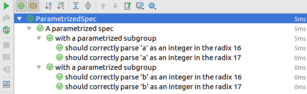

Library for writing beautiful, [RSpec](http://rspec.info/)/[Jasmine](http://jasmine.github.io/)/[Mocha](https://mochajs.org/)/[Jest](https://facebook.github.io/jest/)-style specifications in Java, [Kotlin](https://kotlinlang.org/) and [Groovy](http://www.groovy-lang.org/)
-----------------------------------------------------------

This is the reference documentation for the Specnaz library.
For a quick introduction to Specnaz, check out the main
[Readme file](../Readme.md). For code examples, look into the
[src/examples directory](../src/examples).

Table of Contents
=================

  * [Getting Specnaz](#getting-specnaz)
    * [Using dependency managers (Maven, Gradle etc.)](#using-dependency-managers-maven-gradle-etc)
    * [Manual configuration](#manual-configuration)
  * [Writing tests](#writing-tests)
    * [Basic test structure - the Specnaz interface](#basic-test-structure---the-specnaz-interface)
    * [Framework integrations - JUnit](#framework-integrations---junit)
    * [Calling describes](#calling-describes)
    * [Creating the spec](#creating-the-spec)
      * [should](#should)
      * [shouldThrow](#shouldthrow)
      * [beginsEach](#beginseach)
      * [endsEach](#endseach)
      * [beginsAll](#beginsall)
      * [endsAll](#endsall)
      * [describes](#describes)
        * [Nested specifications and fixture execution order](#nested-specifications-and-fixture-execution-order)
          * [Difference between RSpec and Jasmine](#difference-between-rspec-and-jasmine)
      * [fshould](#fshould)
      * [fshouldThrow](#fshouldthrow)
      * [fdescribes](#fdescribes)
      * [xshould](#xshould)
      * [xshouldThrow](#xshouldthrow)
      * [xdescribes](#xdescribes)
    * [Using Boxes](#using-boxes)
    * [Parametrized test support](#parametrized-test-support)
      * [Parametrized sub-specifications](#parametrized-sub-specifications)
      * [Focusing and ignoring parametrized tests](#focusing-and-ignoring-parametrized-tests)
    * [Using Specnaz in other JVM languages](#using-specnaz-in-other-jvm-languages)
      * [Kotlin](#kotlin)
        * [Using native Java classes](#using-native-java-classes)
        * [Using the Kotlin bindings](#using-the-kotlin-bindings)
          * [Ignoring specs inheriting from SpecnazKotlinJUnit](#ignoring-specs-inheriting-from-specnazkotlinjunit)
        * [The Deferred helper](#the-deferred-helper)
        * [Parametrized tests in Kotlin](#parametrized-tests-in-kotlin)
      * [Groovy](#groovy)
    * [Framework extensions](#framework-extensions)
      * [JUnit Rules](#junit-rules)
        * [Class JUnit Rules](#class-junit-rules)
        * [Instance JUnit Rules](#instance-junit-rules)
        * [Setting the test method](#setting-the-test-method)
        * [JUnit Rules examples](#junit-rules-examples)
  * [Extending Specnaz](#extending-specnaz)

# Getting Specnaz

## Using dependency managers (Maven, Gradle etc.)

Specnaz is available through the Bintray Maven repository.
Take a look at the [main Readme file](../Readme.md#getting-specnaz) on how to get it using
build tools that also do dependency management
(Maven, Gradle, SBT, Ivy etc.).

## Manual configuration

If you're not using a dependency manager, you need to manually download
the needed JARs and put them on your classpath:

* [specnaz](https://jcenter.bintray.com/org/specnaz/specnaz/1.3/specnaz-1.3.jar)
* [specnaz-junit](https://jcenter.bintray.com/org/specnaz/specnaz-junit/1.3/specnaz-junit-1.3.jar)

If you want to use the Kotlin integration,
in addition to the ones above, you also need:

* [specnaz-kotlin](https://jcenter.bintray.com/org/specnaz/specnaz-kotlin/1.3/specnaz-kotlin-1.3.jar)
* [specnaz-kotlin-junit](https://jcenter.bintray.com/org/specnaz/specnaz-kotlin-junit/1.3/specnaz-kotlin-junit-1.3.jar)

# Writing tests

## Basic test structure - the Specnaz interface

The requirements that your tests class must fulfill are simple.
There are 3 of them:

* Your test classes must implement the `org.specnaz.Specnaz` interface
   This is an interface with one method (`describes`) which is default
   (it has an implementation), so your class doesn't need any
   additional code to use it.
* Your test class must have a public, no-argument constructor.
* In that constructor, the `describes` method from the `org.specnaz.Specnaz`
interface must be called *exactly once*.
    The `describes` method is how you construct the tests
    (usually called 'specifications' by convention)
    in Specnaz. We will look at that method in more details in later chapters.

## Framework integrations - JUnit

Specnaz currently supports only JUnit as the testing harness
(work is underway on adding others, like TestNG).

The easiest way to use it is to extend the `org.specnaz.junit.SpecnazJUnit`
helper class, which already implements the `Specnaz` interface:

```java
public class StackSpec extends SpecnazJUnit {
    // body of the spec here...
}
```

If you want to extend a class other than `SpecnazJUnit`,
you need to specify the JUnit `Runner` for Specnaz,
`org.specnaz.junit.SpecnazJUnitRunner`,
using the `@RunWith` annotation:

```java
@RunWith(SpecnazJUnitRunner.class)
public class StackSpec extends CommonSpec implements Specnaz {
    // body of the spec here...
}
```

## Calling `describes`

Because the `describes` method needs to be called in the default constructor,
the most concise way of formulating your specification is by using Java's
initializer block:

```java
public class StackSpec extends SpecnazJUnit {
    {
        describes("A Stack", it -> {
            // body of the spec here...
        });
    }
}
```

You can use the "double-braces" syntax as well,
which saves you one level of indentation:

```java
public class StackSpec extends SpecnazJUnit {{
    describes("A Stack", it -> {
        // body of the spec here...
    });
}}
```

The first argument to the method is the top-level description of the spec.

As you can see, by convention, the parameter of the closure given as the
second argument, of type `org.specnaz.SpecBuilder`, is named `it`.
The methods in the `SpecBuilder` interface were named expecting this
convention, and sticking to it assures that your specification reads well
(it also means you will be consistent with specs written in languages
other than Java).

## Creating the spec

The specification is built by calling methods on the declared
`SpecBuilder` instance. They are:

### should

The `should` method introduces a test.
It's the equivalent of RSpec's or Jasmine's `it` method.

Simple example:

```java
public class StackSpec extends SpecnazJUnit {{
    describes("A Stack", it -> {
        it.should("be empty when first created", () -> {
            Stack<Integer> newStack = new Stack<>();
            
            Assert.assertTrue(newStack.isEmpty());
        });
    });
}}
```

You can have any number of these tests in one group:

```java
public class StackSpec extends SpecnazJUnit {{
    describes("A Stack", it -> {
        it.should("be empty when first created", () -> {
            Stack<Integer> newStack = new Stack<>();
            
            Assert.assertTrue(newStack.isEmpty());
        });
        
        it.should("have size 0 when first created", () -> {
            Stack<Integer> newStack = new Stack<>();
            
            Assert.assertEquals(0, newStack.size());
        });
    });
}}
```

**Note**: Specnaz does not impose any ordering between tests in one group
(unlike with `begins` / `ends` methods,
which always execute in the same order they were defined in a group) -
in particular, they might *not* execute in the same order as they were written.
You should not write your tests in a way that makes them dependent on their relative order.

The descriptions you give as the first argument will become the test
names in the report - except they will have the word "should" prepended
to them, so formulate your descriptions with that in mind.

Note that you cannot nest `should` methods inside each other;
something like this:

```java
it.should("first test", () -> {
    it.should("nested test", () -> { // this is wrong!
```

wil not work. Take a look at the `describes` method below if you want to
nest test contexts within each other.

### shouldThrow

This method is very similar to the `should` method - it also introduces a test.
The difference is that the test passes only if executing it results in an Exception
of the type passed to this method.

Example:

```java
it.shouldThrow(ArithmeticException.class, "when dividing by zero", () -> {
    int unused = 1 / 0;
});
```

The description you give as the second argument will become the test name in the report -
except it will have the words "should throw ExpectedExceptionClass" prepended to them,
so formulate your descriptions with that in mind.

`shouldThrow` returns an instance of the `org.specnaz.utils.ThrowableExpectations` class,
which allows you to formulate further assertions on the thrown Exception.
Each method of that class returns either `this`, or another instance of the same class,
which makes chaining assertions easy. Example:

```java
it.shouldThrow(ArithmeticException.class, "when dividing by zero", () -> {
    int unused = 1 / 0;
}).withMessage("/ by zero").withoutCause();
```

### beginsEach

The `beginsEach` method introduces a test fixture that will be ran before
each `should` test case.
It's the equivalent of RSpec's or Jasmine's `beforeEach`.
You can also think of it as JUnit's `@Before` or TestNG's `@BeforeTest`.

Example:

```java
public class StackSpec extends SpecnazJUnit {
    Stack<Integer> stack;

    {
        describes("A Stack", it -> {
            it.beginsEach(() -> {
                stack = new Stack<>();
            });

            it.should("be empty when first created", () -> {
                Assert.assertTrue(stack.isEmpty());
            });

            it.should("have size 0 when first created", () -> {
                Assert.assertEquals(0, stack.size());
            });
        });
    }
}
```

You can have any number of `beginsEach` fixtures in each group,
and they are guaranteed to run in the order that they were declared.

### endsEach

The `endsEach` method is analogous to `beginsEach`, except it runs _after_
each test case introduced by `should`.
It's the equivalent of RSpec's or Jasmine's `afterEach`.
You can also think of it as JUnit's `@After` or TestNG's `@AfterTest`.

Example:

```java
public class StackSpec extends SpecnazJUnit {
    Stack<Integer> stack = new Stack<>();

    {
        describes("A Stack", it -> {
            it.endsEach(() -> {
                stack = new Stack<>();
            });

            it.should("be empty when first created", () -> {
                Assert.assertTrue(stack.isEmpty());
            });

            it.should("have size 0 when first created", () -> {
                Assert.assertEquals(0, stack.size());
            });
        });
    }
}
```

You can have any number of `endsEach` fixtures in each group,
and they are guaranteed to run in the order that they were declared.

### beginsAll

The `beginsAll` method is similar to `beginsEach`,
except it runs once, before all of the `should` test cases.
It's the equivalent of RSpec's or Jasmine's `beforeAll`.
You can also think of it as JUnit's or TestNG's `@BeforeClass`.

Example:

```java
public class StackSpec extends SpecnazJUnit {
    Stack<Integer> stack;

    {
        describes("A Stack", it -> {
            it.beginsAll(() -> {
                stack = new Stack<>();
            });

            it.should("be empty when first created", () -> {
                Assert.assertTrue(stack.isEmpty());
            });

            it.should("have size 0 when first created", () -> {
                Assert.assertEquals(0, stack.size());
            });
        });
    }
}
```

You can have any number of `beginsAll` fixtures in each group,
and they are guaranteed to run in the order that they were declared.

### endsAll

The `endsAll` method is analogous to `beginsAll`:
it runs once, after all of the test cases introduced by `should`.
It's the equivalent of RSpec's or Jasmine's `afterAll`.
You can also think of it as JUnit's or TestNG's `@AfterClass`.

Example:

```java
public class StackSpec extends SpecnazJUnit {
    Stack<Integer> stack = new Stack<>();

    {
        describes("A Stack", it -> {
            it.endsAll(() -> {
                stack = new Stack<>();
            });

            it.should("be empty when first created", () -> {
                Assert.assertTrue(stack.isEmpty());
            });

            it.should("have size 0 when first created", () -> {
                Assert.assertEquals(0, stack.size());
            });
        });
    }
}
```

You can have any number of `endsAll` fixtures in each group,
and they are guaranteed to run in the order that they were declared.

### describes

The `describes` method is what gives Specnaz its power.
It's used to create sub-specifications,
which share their parent's fixtures.

Example:

```java
public class StackSpec extends SpecnazJUnit {{
    describes("A Stack", it -> {
        Stack<Integer> stack = new Stack<>();

        it.endsEach(() -> {
            stack.clear();
        });

        it.should("be empty when first created", () -> {
            Assert.assertTrue(stack.isEmpty());
        });

        it.describes("with 10 and 20 pushed on it", () -> {
            it.beginsEach(() -> {
                stack.push(10);
                stack.push(20);
            });

            it.should("have size equal to 2", () -> {
                Assert.assertEquals(2, stack.size());
            });

            it.should("have 20 as the top element", () -> {
                Assert.assertEquals(20, (int)stack.peek());
            });
        });
    });
}}
```

You can have any number of `describes` methods in each group.
The nested spec can use exactly the same methods the parent one can,
including `describes`, which means you can create arbitrary-shaped
specification trees.

#### Nested specifications and fixture execution order

It's important to understand precisely the order in which fixtures execute
in case of nested specifications.
To do that, we first need to introduce the concept of *groups*.

A *group* is simply the collection of fixtures and tests on the same
level of nesting in the specification tree.

That may sound a little abstract, so here's an example:

```java
public class NestedSpec extends SpecnazJUnit {{
    describes("Outer group", it -> {
        it.beginsAll(() -> {
            // outer group beginsAll
        });
        
        it.beginsEach(() -> {
            // outer group beginsEach
        });
        
        it.endsEach(() -> {
            // outer group endsEach
        });
        
        it.endsAll(() -> {
            // outer group endsAll
        });
        
        it.should("outer group test 1", () -> {
            // outer group test 1
        });
        
        it.should("outer group test 2", () -> {
            // outer group test 2
        });
        
        it.describes("inner group", () -> {
            it.beginsAll(() -> {
                // inner group beginsAll
            });
            
            it.beginsEach(() -> {
                // inner group beginsEach
            });
            
            it.endsEach(() -> {
                // inner group endsEach
            });
            
            it.endsAll(() -> {
                // inner group endsAll
            });
            
            it.should("inner group test 1", () -> {
                // inner group test 1
            });
            
            it.should("inner group test 2", () -> {
                // inner group test 2
            });
        });
    });
}}
```

This specification consists of two groups, named 'outer' and 'inner'.
Each group has one of every type of fixture, and two test cases.
Because they are nested, we say that 'inner' is a *child group* of 'outer';
conversely, 'outer' is a *parent group* of 'inner'.

The first, obvious rule, is that child groups have no influence on the
execution of parent groups.
So, the outer group will execute as follows:

**Note**: Specnaz does not impose any ordering between tests in the same group
(unlike with `begins` / `ends` methods in the same group,
which always execute in the same order they were defined).
In the below examples, we assume they will execute in the same order as they were written.
However, that's not guaranteed by the framework, and you shouldn't rely on it in your tests.

* outer group beginsAll
* outer group beginsEach
* outer group test 1
* outer group endsEach
* outer group beginsEach
* outer group test 2
* outer group endsEach
* outer group endsAll

In case of nested groups, the rule is fairly simple:

> When a group's test cases are executed,
> all of the ancestor groups fixtures are executed as well.

The only difference is the order in which they are executed:

* `beginsAll`/`beginsEach` execute in 'outside-in' order -
meaning, from the top-most parent down to the child group being executed
* `endsAll`/`endsEach` execute in reverse order, so 'inside-out' -
starting from the child group being executed up to the top-most parent group

So, the execution of the 'inner' group will look like the following:

* outer group beginsAll
* inner group beginsAll
* outer group beginsEach
* inner group beginsEach
* inner group test 1
* inner group endsEach
* outer group endsEach
* outer group beginsEach
* inner group beginsEach
* inner group test 2
* inner group endsEach
* outer group endsEach
* inner group endsAll
* outer group endsAll

##### Difference between RSpec and Jasmine

If you have experience with similar testing tools in other languages,
like RSec and Jasmine, you might notice that Specnaz behaves differently here.

In RSpec and Jasmine, the child groups do not execute their parent's
`beforeAll`/`afterAll` callbacks again.
They are executed only once, when that group's test cases are ran
(the `afterAll` ones when the last child group is finished).

Both ways of executing the fixtures make sense, and both are useful under
different circumstances.
They are also equivalent - you can express one in terms of the other.

The reason for doing it this way is that Specnaz was designed for Java.
And in Java, while it's fairly easy to go from the Specnaz way to the
RSpec/Jasmine way, it's much harder to go in the opposite direction.
Let me illustrate.

Let's say we have the following Jasmine spec:

```javascript
describe("outer group", function () {
    beforeAll(function () {
        // beforeAll setup...
    });
    
    it("outer test", function () {
        // outer group test
    });
    
    describe("inner group", function () {
        it("inner test", function () {
            // inner group test
        });
    });
});
```

The `beforeAll` setup will run only once, right before the `outer test`,
and not again before `inner test`.

If we wanted to achieve the same in Specnaz, it would be fairly straightforward:

```java
public class BeforeAllOnceSpec extends SpecnazJUnit {
    boolean setupRan = false;

    {
        describes("outer group", it -> {
            it.beginsAll(() -> {
                if (!setupRan) {
                    setupRan = true;
                    // beforeAll setup...
                }
            });

            it.should("outer test", () -> {
                // outer group test
            });

            it.describes("inner group", () -> {
                it.should("inner test", () -> {
                    // inner group test
                });
            });
        });
    }
}
```

However, imagine the opposite - that we wanted to have the Specnaz
behavior in the Jasmine spec.
It would look something like the following:

```javascript
describe("outer group", function () {
    function init() {
        // beforeAll setup...
    }
    
    beforeAll(function () {
        init();
    });

    it("outer test", function () {
        // outer group test
    });
    
    describe("inner group", function () {
        beforeAll(function () {
            init();
        });

        it("inner test", function () {
            // inner group test
        });
    });
});
```

While this is easy to achieve in JavaScript, in Java, we don't have nested
methods, which makes it a lot more cumbersome.
We can use objects and lambda expressions to simulate JavaScript's local
functions, but that is a lot more awkward and less readable,
both for the definition and then later for the usage.
We can use instance methods on the test class itself,
but that means we can't define them on the level that they are actually used,
and they won't have access to the variables of the closure.

For these reasons, Specnaz changes the traditional behavior of the
`beginsAll` and `endsAll` fixtures.

If you need to perform some setup and/or teardown that should happen once per class
(and not once per group), you can achieve that using the [JUnit Class Rules API](#class-junit-rules)
that Specnaz supports natively.

### fshould

`fshould` is a way to temporary mark a given `should` test as 'focused'.
This works exactly like in [RSpec](http://rspec.info/) and [Jasmine](http://jasmine.github.io/).
If a class contains at least one focused test, then only focused tests will be ran when it is executed -
unfocused (that is, created with `should`) tests will be ignored.
This is useful when wanting to run and debug a single test in a class -
it's easy to run a single test when using 'vanilla' JUnit, but quite hard with Specnaz
(the IDEs and build tools were not really designed for tree-based tests).
With this method, you can simply add an 'f' in front of a call to `should`,
and the next time this spec class is ran, only the `fshould` tests will actually be executed.

Naturally, all of the fixtures
(`beginsAll/Each` and `endsAll/Each`) in the tree will be executed,
just like for regular, 'unfocused' tests -
including fixtures from parent groups whose tests were all ignored
because of not being focused. Example:

```java
class FocusedSpec {
    int counter = 1;

    {
        describes("A focused test", it -> {
            it.beginsAll(() -> {
                counter++;
            });
            
            it.should("not run this test", () -> {
                Assert.fail("this should not be executed");
            });
            
            it.describes("with a focused subgroup", () -> {
                it.fshould("run this test", () -> {
                    Assert.equals(2, counter);
                });
            });
        });
    }
}
```

This method is deprecated, as it's only meant as a temporary stop gap to aid you in debugging a failing test -
it's not meant to be part of the test suite permanently.
Deprecating it means there is a higher chance you notice it,
and remember to remove the 'f' at the beginning before committing the change to source control.

### fshouldThrow

This is the focused equivalent of `shouldThrow`.
The thinking behind this method is the same as behind `fshould`,
and it's deprecated for exactly the same reason.

### fdescribes

This is the focused equivalent of `describes`.
All tests present in this focused group
(including subgroups of this group) will be focused,
even if defined with regular `should` and `describes` calls
instead of `fshould` and `fdescribes`.

### xshould

`xshould` is a way to ignore the given test.
This works exactly like in [RSpec](http://rspec.info/) and [Jasmine](http://jasmine.github.io/).
If you ever need to ignore a test for any reason, instead of fiddling with commenting out code,
simply add an 'x' in front of the call to [should](#should),
and this specific test will not be executed.

### xshouldThrow

This is the [shouldThrow](#shouldthrow) equivalent of `xshould` -
ignores a test expecting an Exception.

### xdescribes

`xdescribes` allows you to ignore an entire subtree of tests
(including sub-specifications defined with `describes`).

**Note**: there is also an `xdescribes` at the top level
(the one that you call in the constructor) - in that case,
all of the specifications in the class will be skipped.

## Using `Box`es

One awkward part of writing specs in Java is the limitation that inside
the lambda expression, you can only reference final and effectively
final variables of the enclosing scope.
We often want to write something like this:

```java
public class StackSpec extends SpecnazJUnit {{
    Stack<Integer> stack;
    
    describes("A Stack", it -> {
        it.beginsEach(() -> {
            stack = new Stack<>(); // not valid in Java!
        });
        
        // rest of the spec here...
    });
}}
```

We can work around this by using instance variables of the test class,
like we have been in these examples.
However, that means we can't use the "double braces" syntax,
meaning we need to have the code indented an extra level, and, even worse,
we have to define all of the local test variables at the same level,
instead of doing it where they are actually used, making our tests less readable.

To help with this use-case, Specnaz ships with a utility class -
`org.specnaz.utils.Box`, which is a very simple wrapper around any value,
which is kept in a `public` field, called `$`.
This way, the reference to the `Box` class is final,
but the value of the field can be mutated at will.

Here is a simple example:

```java
public class StackSpec extends SpecnazJUnit {{
    Box<Stack<Integer>> stack = Box.emptyBox();

    describes("A Stack", it -> {
        it.beginsEach(() -> {
            stack.$ = new Stack<>();
        });

        it.should("be empty when first created", () -> {
            assertThat(stack.$).isEmpty();
        });
    });
}}
```

For readability, and to leverage Java's type inference, `Box` has a
private constructor - you create instances of it using static factory
methods, `emptyBox` and `boxWith`.

There are also equivalent classes for boxing primitive values
(`int`, `bool`, `long` etc.), named `IntBox`, `BoolBox`, `LongBox` etc.

## Parametrized test support

Specnaz has built-in support for writing parametrized tests.

In order to get access to the parametrized tests capabilities,
you need to implement the `org.specnaz.params.SpecnazParams`
interface in your test class instead of the regular `Specnaz` one.
There is a helper class, `org.specnaz.params.junit.SpecnazParamsJUnit`,
which is analogous to the regular `SpecnazJUnit` helper, that you can extend:

```java
import org.specnaz.params.junit.SpecnazParamsJUnit;

public class MyParametrizedSpec extends SpecnazParamsJUnit {
    // body of the spec here...   
}
```

If you're implementing the interface directly,
you provide the same Runner with the `@RunWith` annotation,
`SpecnazJUnitRunner`, as you would for regular (non-parametrized) tests:

```java
import org.junit.runner.RunWith;
import org.specnaz.junit.SpecnazJUnitRunner;
import org.specnaz.params.SpecnazParams;

@RunWith(SpecnazJUnitRunner.class)
public class MyParametrizedSpec extends MyParent implements SpecnazParams {
    // body of the spec here...
}
```

The way you define parametrized tests is very similar to regular, non-parametrized ones.
The difference is that instead of passing a no-argument lambda
as the body of the test to a `should` or `shouldThrow` method,
you instead pass a lambda expecting between one and nine arguments.
You use these arguments in your test case as parameters,
and then call the `provided` method on the object `should` or `shouldThrow` returns.

The `provided` method is used to specify with what parameters should the tests run.
The parameters are given by passing instances of the `ParamsX` class,
where `X` is the arity of the lambda passed to `should` or `shouldThrow` -
so, if you passed a two-argument lambda, you need to provide instances of the `Params2` class.

Each of the `ParamsX` classes contains a static factory method named `pX`
used for constructing instances of it (so, `Params2` has `p2`, `Params3` - `p3`, etc.).
You can provide the instances directly, using variadic arguments,
or through a Collection of the appropriate `ParamsX` type.
Each instance of a `ParamsX` class you provide will result in a separate test being executed and reported.

Example:

```java
import org.specnaz.params.junit.SpecnazParamsJUnit;
import static org.specnaz.params.Params3.p3;

public class ParametrizedSpec extends SpecnazParamsJUnit {{
    describes("A parametrized spec", it -> {
        it.should("confirm that %1 + %2 = %3", (Integer a, Integer b, Integer c) -> {
            assertThat(a + b).isEqualTo(c);
        }).provided(
                p3(1, 2, 3),
                p3(4, 4, 8),
                p3(-3, 3, 0),
                p3(Integer.MAX_VALUE, 1, Integer.MIN_VALUE)
        );
    });
}}
```

Because we gave a 3-parameter lambda to `should`,
we need to call `provided` with instances of `Params3`.
As we gave four instances in the call,
this will result in 4 tests being executed.

We also used the special placeholders in the description string: `%1`, `%2`, etc.
These will be expanded at runtime by the library with the values
of the parameters at the appropriate index, counting from 1.
So, the spec above will look like this when executed:


There is a slight difference when the lambda you provided to `should` or `shouldThrow`
takes only one argument
(in other words, for a parametrized test with a single parameter).
In that case, there is no `Params1` class -
you just provide the values directly, either as variadic arguments,
or as a Collection.

Example:

```java
it.shouldThrow(NumberFormatException.class, "when trying to parse '%1' as an Int", (String str) -> {
    Integer.parseInt(str);
}).provided("a", "b");
```

The `provided` methods return objects of the same type that regular,
non-parametrized tests would - so, [`TestSettings`](#setting-the-test-method) for `should`,
and [`ThrowableExpectations`](#shouldthrow) for `shouldThrow`.
Which means we could have expanded the above example with some additional
assertions on the thrown Exception as follows:

```java
it.shouldThrow(NumberFormatException.class, "when trying to parse '%1' as an Int", (String str) -> {
    Integer.parseInt(str);
}).provided("a", "b").withoutCause();
```

The `TestSettings` and `ThrowableExpectations` objects returned by `provided`
are shared between all instances of the tests when they are expanded with parameters.

### Parametrized sub-specifications

You can also provide a lambda with arguments to the `describes` method,
in that way creating a parametrized sub-specification.
It behaves exactly like you would expect:
you need to call the `provided` method on the object the parametrized `describes` returns,
exactly like for parametrized `should` and `shouldThrow`,
and there will be a separate sub-specification created for each instance of the appropriate `ParamsX`
class that you provide in that call.

**Note**: you can use the `String.format` method to dynamically set the descriptions of the tests
inside the sub-specification, depending on the value(s) of the parameters.
But if you want to combine that with the placeholders Specnaz expands,
remember that you need to escape the `%` character in the call to `format`
by writing a double percent. So, the placeholder would look something like `%%1` in that case.

For example, this specification:

```java
it.describes("with a parametrized subgroup", (String str) -> {
    it.should(format("correctly parse '%s' as an integer in the radix %%1", str), (Integer radix) -> {
        Integer.parseInt(str, radix);
    }).provided(16, 17);
}).provided("a", "b");
```

will result in the following tests tree:



### Focusing and ignoring parametrized tests

You can also [focus](#fshould) and [ignore](#xshould) parametrized tests and sub-specifications.
It works exactly like for non-parametrized tests -
simply add an `f` or an `x` in front of a call to define a parametrized test or sub-specification,
and all tests that will be executed as a result of it will be focused or ignored.

## Using Specnaz in other JVM languages

### Kotlin

Specnaz has first-class support for writing specs in Kotlin.

#### Using native Java classes

You can use the Java Specnaz classes from Kotlin without any problems:

```kotlin
class StackJavaSpec : SpecnazJUnit() { init {
    describes("A Stack") {
        var stack = Stack<Int>()

        it.endsEach {
            stack = Stack()
        }

        it.should("be empty when first created") {
            Assert.assertTrue(stack.isEmpty())
        }

        it.describes("with 10 and 20 pushed on it") {
            it.beginsEach {
                stack.push(10)
                stack.push(20)
            }

            it.should("have size equal to 2") {
                Assert.assertEquals(2, stack.size)
            }

            it.should("have 20 as the top element") {
                Assert.assertEquals(20, stack.peek())
            }
        }
    }
}}
```

As you can see, the Kotlin test is very similar to the Java one, but looks
a little better - there is less punctuation (semicolons are gone, the parenthesis
can be closed after the first argument or omitted entirely, as Kotlin allows
you to give the lambda expression outside of them if it's the last parameter)
and you don't have to name the parameter to the lambda given as the second
argument to the `describes` method - Kotlin automatically binds it to the
`it` variable.
Kotlin also doesn't have the limitation that variables referenced in closures
must be final or effectively final, which means you don't have to use the
`Box` classes.

#### Using the Kotlin bindings

Specnaz also includes a separate subproject that provides classes
tailor-made to be used from Kotlin.

Here is an example of using them:

```kotlin
class StackKotlinSpec : SpecnazKotlinJUnit("A Stack", {
    var stack = Stack<Int>()

    it.endsEach {
        stack = Stack()
    }

    it.should("be empty when first created") {
        Assert.assertTrue(stack.isEmpty())
    }

    it.describes("with 10 and 20 pushed on it") {
        it.beginsEach {
            stack.push(10)
            stack.push(20)
        }

        it.should("have size equal to 2") {
            Assert.assertEquals(2, stack.size)
        }

        it.should("have 20 as the top element") {
            Assert.assertEquals(20, stack.peek())
        }
    }
})
```

They provide the following advantages:

* The JUnit helper class, `org.specnaz.kotlin.junit.SpecnazKotlinJUnit`,
implements the Kotlin analog of the `Specnaz` interface,
`org.specnaz.kotlin.SpecnazKotlin`, and calls the `describes` method
from that interface in its primary constructor.
Which means you can save one level of indentation when you don't need
to extend a particular superclass.
* The Kotlin equivalent of `SpecBuilder`, `org.specnaz.kotlin.KotlinSpecBuilder`,
defines its own versions of all of the spec building methods like `should`,
`beginsEach`, `describes` etc., with signatures using the Kotlin function types.
This is better in 2 ways:
    * the IDE support is better (for example, Intellij lists each
    method of the `SpecBuilder` twice in the auto-completion menu when using it from Kotlin,
    once with the Kotlin function signature and once with the `TestClosure` signature,
    which is irritating)
    * you get better type-safety, as all of the redefined fixture functions
    (`beginsAll` / `each`, `endsAll` / `each`) take a `Nothing?`
    (Kotlin's equivalent of Java's `Void`) as their first argument,
    which means that if you didn't override the default name of lambda parameter (`it`),
    the type system will not allow you to do illegal things when building the spec
    (like calling `should` from inside a `beginsEach`).

If your test class has to extend a particular class, you can still get
the last two benefits by using the `org.specnaz.kotlin.junit.SpecnazKotlinJUnitRunner`
JUnit `Runner` and implementing `SpecnazKotlin`:

```kotlin
@RunWith(SpecnazKotlinJUnitRunner::class)
class StackKotlinSpec : SpecCommon(), SpecnazKotlin { init {
    describes("A Stack") {
        // spec body...
    }
}}
```

##### Ignoring specs inheriting from `SpecnazKotlinJUnit`

If you want to ignore an entire class of specs, and that class inherits from `SpecnazKotlinJUnit`,
you can't simply use the `xdescribes` method call, as that code is buried in the `SpecnazKotlinJUnit` constructor.
To help with that case, there is a class called `xSpecnazKotlinJUnit` in the same,
`org.specnaz.kotlin.junit` package.
With that, you can simply add an 'x' in front of `SpecnazKotlinJUnit`,
and with that one change ignore all of the specs defined in that class.

#### The `Deferred` helper

One irritating thing about writing tests in Kotlin is that the compiler
checks both for `null` values and forces variables to be always initialized
before being used. That's of course great in production code, but gets
tedious in tests. For example:

```kotlin
class KotlinSpec : SpecnazKotlinJUnit("A spec", {
    var someDomainClass: MyDomainClass
    
    it.beginsEach {
        someDomainClass = myDomainOperation()
    }
    
    it.should("do something properly") {
        Assert.assertTrue(someDomainClass.something()); // does not compile!
    }
})
```

The above snippet will not work - the compiler will complain that
`someDomainClass` must be initialized before being used.

The easiest way to solve this problem is to use the `lazyinit` modifier -
so, simply replace `var someDomainClass: MyDomainClass` above with
`lateinit var someDomainClass: MyDomainClass`.
However, that's allowed on local variables only with Kotlin version 1.2 or later -
before that `lateinit` was limited to class attributes.
If you're on a version of Kotlin before 1.2,
you can still use local variables instead of class attributes in this case
by leveraging a simple helper class that ships with Specnaz,
`org.specnaz.kotlin.utils.Deferred`.
You use it like so:

```kotlin
class KotlinSpec : SpecnazKotlinJUnit("A spec", {
    val someDomainClass = Deferred<MyDomainClass>()

    it.beginsEach {
        someDomainClass.v = myDomainOperation()
    }
    
    it.should("do something properly") {
        Assert.assertTrue(someDomainClass.v.something());
    }
})
```

The value of the appropriate type will be stored in the `v`
public instance variable of the `Deferred` class, and you can use it
without explicitly initializing it first, which means the above code will
compile.

If you're willing to use inheritance (`Deferred` is an open class),
you can make your tests read even better:

```kotlin
class KotlinSpec : SpecnazKotlinJUnit("A spec", {
    val someDomainClass = object : Deferred<MyDomainClass>() {
        val something: Boolean get() = v.something
    }

    it.beginsEach {
        someDomainClass.v = myDomainOperation()
    }
    
    it.should("do something properly") {
        Assert.assertTrue(someDomainClass.something()); // notice no '.v'
    }
})
```

#### Parametrized tests in Kotlin

Kotlin also has its own version of the parametrized Specnaz interface, `SpecnazParams`:
`org.specnaz.kotlin.params.SpecnazKotlinParams`.
You can implement it directly, or inherit from a helper,
`org.specnaz.kotlin.params.junit.SpecnazKotlinParamsJUnit`.
There's also `xSpecnazKotlinParamsJUnit` in the same package if you need to ignore an
entire parametrized specification.

Other than that, parametrized tests in Kotlin are basically the same as in Java:
pass a lambda expression with up to nine arguments to `should`,
use them inside the test, and then call `provided` on the object returned from `should`.
Example:

```kotlin
class KotlinParametrizedSpec : SpecnazKotlinParamsJUnit("A parametrized spec", {
    it.should("confirm that %1 + %2 = %3") { a: Int, b: Int, c: Int ->
        assertThat(a + b).isEqualTo(c)
    }.provided(
            p3(1, 2, 3),
            p3(4, 4, 8),
            p3(-3, 3, 0),
            p3(Int.MAX_VALUE, 1, Int.MIN_VALUE)
    )
})
```

The one difference can be when writing parametrized `shouldThrow` tests.
Because in the Kotlin version of that method,
you specify the expected Exception as a type parameter,
and not an instance of the `Class` type,
you also have to specify the types of the parameters
of the lambda you passed as the test body.
Because of that, you don't have to repeat the types in the lambda itself.
Like this:

```kotlin
it.shouldThrow<NumberFormatException, String>("when parsing '%1' as an Int") { str ->
    Integer.parseInt(str)
}.provided("b", "c")
```

### Groovy

You can use the Specnaz from Groovy without any special bindings.
Check out the [Readme file of the Groovy examples](../src/examples/specnaz-groovy-examples/Readme.md)
for more info.

## Framework extensions

### JUnit Rules

Specnaz supports the [JUnit Rules API](https://github.com/junit-team/junit4/wiki/rules) natively.
The integration looks a tiny bit different than in 'vanilla' JUnit,
mostly because of the different object lifecycle
(in 'vanilla' JUnit, each test executes with its own instance of the test class;
in Specnaz, all tests share the same object instance).
However, the basic idea is exactly the same.

JUnit supports 2 types of Rules:
class Rules (those annotated with [@ClassRule](http://junit.org/junit4/javadoc/4.12/org/junit/ClassRule.html))
and instance Rules (those annotated with [@Rule](http://junit.org/junit4/javadoc/4.12/org/junit/Rule.html)).
Both of them are supported in Specnaz.

Let's start with class Rules, as they are simpler.

#### Class JUnit Rules

Class Rules work pretty much exactly the same as 'vanilla' JUnit.
It's a `public`, `static` field of the test class,
annotated with [@ClassRule](http://junit.org/junit4/javadoc/4.12/org/junit/ClassRule.html).

**Note**: 'vanilla' JUnit also allows class Rules returned by (`static`) methods.
This is not supported by Specnaz.

Example:

```java
import org.junit.ClassRule;
import org.specnaz.junit.SpecnazJUnit;
import org.springframework.test.context.junit4.rules.SpringClassRule;

public class SpringSpec extends SpecnazJUnit {
    @ClassRule
    public static final SpringClassRule springClassRule = new SpringClassRule();
    
    {
        describes("A Spring spec", it -> {
            // spec body here...
        });
    }
}
```

The Rule works exactly the same like in 'vanilla' JUnit:
it wraps the execution of the entire test class
(that is, it's executed even before any `beginsAll` methods).
Because of that, it's a good place to put any setup or cleanup
that you want to be executed exactly once for the whole class
(and not, like `beginsAll` / `endsAll` methods, for every nested subgroup).
Probably the easiest way to do that is to extend the
[ExternalResource](https://junit.org/junit4/javadoc/4.12/org/junit/rules/ExternalResource.html)
Rule that ships with JUnit.

Example:

```java
import org.junit.ClassRule;
import org.junit.ExternalResource;
import org.specnaz.junit.SpecnazJUnit;

public class SomeSpec extends SpecnazJUnit {
    @ClassRule
    public static final ExternalResource fixture = new ExternalResource() {
        protected void before() {
            // set up here...
        }
    
        protected void after() {
            // ...and tear down here
        }
    };

    {
        describes("A spec", it -> {
            // spec body here...
        });
    }
}
```

If you want to have multiple class Rules in the same class,
it's important to know that the order in which they will be chained is unspecified -
it won't necessarily be the same order that they were declared in in source code.
If you need to control that ordering, you should use the [RuleChain](https://junit.org/junit4/javadoc/4.12/org/junit/rules/RuleChain.html) class
that ships with JUnit.

#### Instance JUnit Rules

Instance Rules work a little bit differently than in 'vanilla' JUnit.
Instead of annotating fields with [@Rule](http://junit.org/junit4/javadoc/4.12/org/junit/Rule.html),
you use the class `org.specnaz.junit.rules.Rule`.

Every `public`, non-`static` field of the test class of this type will be picked up by the Runner,
and included in your tests.

**Note**: similarly as with class Rules,
'vanilla' JUnit allows you to have instance Rules returned by methods.
This is also not supported by Specnaz.

You create instances of `Rule` by calling the `of` static factory method,
passing in a lambda expression that returns your Rule.
The Runner will execute your lambda before each test,
this way ensuring that each test has a fresh copy of the Rule -
in other words, instance Rules obey the same lifecycle as `beginsEach` / `endsEach` methods.

You access the current instance of the Rule by using the `r()` method.

Example:

```java
import org.junit.rules.ExpectedException;
import org.specnaz.junit.SpecnazJUnit;
import org.specnaz.junit.rules.Rule;

public class ExpectedExceptionRuleSpec extends SpecnazJUnit {
      public Rule<ExpectedException> expectedException = Rule.of(() -> ExpectedException.none());

      {
          describes("Using the ExpectedException JUnit Rule in Specnaz", it -> {
              it.should("correctly set the expected Exception", () -> {
                  expectedException.r().expect(IllegalArgumentException.class);

                  throw new IllegalArgumentException();
              });
          });
      }
}
```

The same remark about multiple class Rules applies to instance Rules as well -
if you need control over the order in which multiple instance Rules in the same class are applied,
use the [RuleChain](https://junit.org/junit4/javadoc/4.12/org/junit/rules/RuleChain.html) class that ships with JUnit.

#### Setting the test method

Some JUnit Rules recognize certain annotations placed on the test method in a 'vanilla' JUnit test class
(it's quite common in Spring, for example - see
[here](https://docs.spring.io/spring/docs/current/spring-framework-reference/testing.html#integration-testing-annotations)
for a list of recognized annotations).
This is tricky in Specnaz, as tests are defined through method calls, not method declarations,
and you can't place annotations on calls.

For that reason, the `should` method returns an instance of a class, `org.specnaz.TestSettings`,
that allows you to set a custom method for a Specnaz test by calling its
`usingMethod(java.lang.reflect.Method)` method.
The provided `Method` will be passed to all instance JUnit Rules defined in this class.
Because obtaining method instances is somewhat cumbersome in Java,
Specnaz includes a utility method that helps with that,
`org.specnaz.utils.Utils.findMethod`.

Example usage:

```java
import org.specnaz.junit.SpecnazJUnit;
import org.specnaz.utils.Utils;

import org.springframework.test.annotation.DirtiesContext;

public class SomeSpringSpec extends SpecnazJUnit {
    {
        describes("some example tests", it -> {
            it.should("correctly find the method", () -> {
                // test body...
            }).usingMethod(Utils.findMethod(this, "someMethod"));
        });
    }

    @DirtiesContext
    public void someMethod() {
    }
}
```

**Note**: because the `shouldThrow` method returns an instance of a different class (`ThrowableExpectations`),
you can't call `usingMethod` for tests defined using `shouldThrow`.
If you need to combine a JUnit Rule with an exception throwing test that requires annotations on the method,
you have to use `should` and some alternative mechanism of specifying the exception, such as:
* [CatchException](https://github.com/Codearte/catch-exception)
* If you're using [AssertJ](http://joel-costigliola.github.io/assertj/index.html) for assertions,
  you have [a lot of options](http://joel-costigliola.github.io/assertj/assertj-core-features-highlight.html#exception-assertion)
* The [ExpectedException](http://junit.org/junit4/javadoc/4.12/org/junit/rules/ExpectedException.html)
  Rule that ships with JUnit
* You can always use an explicit `try`-`catch` inside the `should` test

#### JUnit Rules examples

Check out the [specnaz-junit-rules-examples subproject](../src/examples/specnaz-junit-rules-examples) -
it contains examples of Specnaz specs using various Rules,
both those that ship with the standard JUnit distribution,
as well as third-party Rules from [Mockito](http://site.mockito.org/),
[Spring](https://spring.io/) and [Dropwizard](http://www.dropwizard.io).

# Extending Specnaz

Specnaz allows you to extend it by creating your own DSL
(Domain-Specific Language) for tests.
In fact, the `begins`/`ends`/`should` DSL that you've seen used in this
documentation is not built-in into the framework -
it's created using the core Specnaz API, which the library clients can use as well.

Take a look at the [specnaz-custom-dsl-example project Readme file](../src/examples/specnaz-custom-dsl-example/Readme.md)
for documentation and a working example of how to extend Specnaz.
